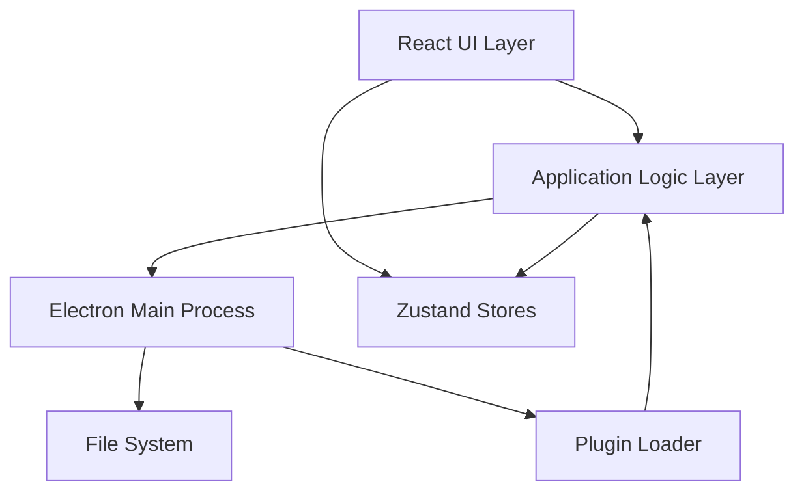
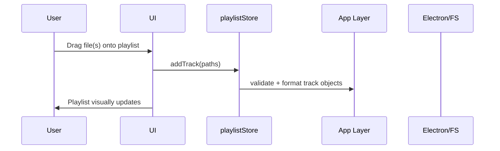
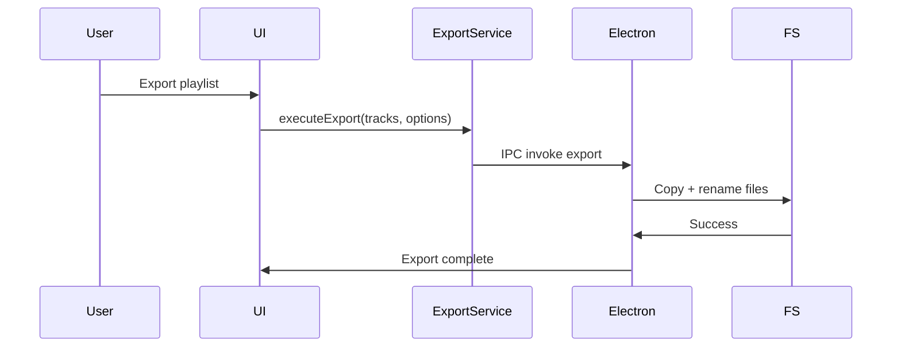

# CherryPlayList --- Full Technical Documentation

This documentation is designed explicitly for ingestion by an LLM during
application development.\
It is verbose, explicit, strictly structured, and modular.

---

# 1. Project Overview

CherryPlayList is a desktop application intended for **personal DJ
workflow optimization**.\
Its main purpose is fast creation and organization of playlists using
**drag‑and‑drop**, manual ordering, and exporting files in a consistent
order.\
The app works **offline**, operates directly on local audio files, and
is built with:

- **Electron** (desktop shell)
- **React + TypeScript** (UI)
- **Zustand** (state management)
- **Local JSON storage**
- **Extensible plugin-based architecture**

The application does **not modify the source audio files**, ensuring
full safety for the music library.

---

# 2. Core Use Cases

## 2.1 Primary User Flow

1.  Open app.
2.  Create new playlist.
3.  Browse files (via built-in File Explorer or other sources).
4.  Drag tracks into playlist.
5.  Reorder tracks manually by dragging.
6.  Export playlist:
    - copy files into a folder
    - rename with sortable numeric prefixes

## 2.2 Secondary User Flows

- Load existing saved playlist.
- Add tracks by dragging files directly from OS file explorer.
- Combine tracks from different folders.
- Quickly access toolbox panels (File Explorer, future modules,
  plugins).
- Save playlist JSON for later reuse.
- Use future smart panels: history, tagged DB, metadata search,
  plugins.

---

# 3. Architecture Overview

The system is separated into **three main layers**:

    ┌──────────────────────────────┐
    │          UI Layer            │ React + TS
    │ - Components                 │ Zustand UI state
    │ - Views/Layouts              │
    └───────────────┬──────────────┘
                    │
    ┌───────────────▼──────────────┐
    │     Application Layer         │
    │ - Playlist manager            │
    │ - Export system               │
    │ - Track sources API           │
    │ - Plugin manager              │
    │ Zustand global state stores   │
    └───────────────┬──────────────┘
                    │ IPC
    ┌───────────────▼──────────────┐
    │        Electron Layer         │
    │ - File operations             │
    │ - FS-safe copying/renaming    │
    │ - Plugin sandbox loading       │
    │ - System dialogs              │
    └───────────────────────────────┘

---

# 4. Architecture Diagrams (Mermaid)

## 4.1 High-Level Component Diagram



## 4.2 Playlist Creation Workflow



## 4.3 Export Workflow



---

# 5. Detailed Module Structure

    project-root/
    ├── electron/
    │   ├── main.ts               # App entry
    │   ├── ipc/                  # All IPC channels
    │   │   ├── export.ts
    │   │   ├── fileBrowser.ts
    │   │   └── plugins.ts
    │   ├── plugins/              # Plugin runtime
    │   └── utils/                # FS helpers
    │
    ├── src/
    │   ├── app/
    │   │   ├── playlist/
    │   │   ├── export/
    │   │   ├── plugins/
    │   │   └── sources/
    │   ├── components/
    │   ├── state/                # Zustand stores
    │   ├── services/             # Frontend logic
    │   ├── types/
    │   ├── hooks/
    │   ├── utils/
    │   └── index.tsx
    │
    ├── plugins/                  # External plugin root folder
    └── public/

## 5.1 Demo Player Module

The demo player is a lightweight audio preview pipeline located in the application header. It does not replace a full queue/playlist player; instead, it plays a single track on demand for quick checks.

### Responsibilities

- Hold a single `HTMLAudioElement` instance that survives workspace switches.
- React to play button clicks originating from any workspace (playlist, collection, future types).
- Track playback metadata: format support relies on Chromium’s audio stack (MP3, WAV, FLAC, M4A, OGG tested).
- Surface actionable UI state (current track, status, timecodes, errors) through a dedicated Zustand store.
- Provide utilities for revealing the current track inside FileBrowser.

### Components

1. **demoPlayerStore** — orchestrates the audio element, exposes actions (`loadTrack`, `play`, `pause`, `seek`, `setVolume`, etc.), stores `position`, `duration`, `volume`, `status`, and `sourceWorkspaceId`.
2. **DemoPlayer component** — rendered at the top of `AppHeader`; shows title, “Show in browser” button, play/pause toggle, timeline slider with live position, and volume slider. Компонент получает данные через `useDemoPlayerController` (можно подменить в тестах), проверяет путь перед вызовом “Показать в браузере” и очищает ресурсы стора при размонтировании.
3. **Playlist/Collection buttons** — every track row owns a play button that calls `demoPlayerStore.loadTrack(track, workspaceId)` followed by `play()`.
4. **FileBrowser bridge** — action in `uiStore` focuses the originating file path when the header button is pressed.

---

# 6. Zustand Stores (Deep Specification)

## 6.1 playlistStore

Handles playlist content.

### State

    {
      name: string
      tracks: Track[]
      selectedTrackIds: Set<string>  // Set of selected track IDs for batch operations
    }

### Actions

    setName(name)
    addTrack(track)
    addTracks(trackArray)
    removeTrack(id)
    moveTrack(fromIndex, toIndex)
    clear()
    loadFromJSON(json)

    // Track selection actions
    selectTrack(id)
    deselectTrack(id)
    selectAll()
    deselectAll()
    toggleTrackSelection(id)
    selectRange(fromId, toId)

    // Batch operations
    removeSelectedTracks()
    moveSelectedTracks(toIndex)

### Implementation Example

```typescript
import create from 'zustand';
import { v4 as uuidv4 } from 'uuid';
import { Track } from '../types/track';

interface PlaylistState {
  name: string;
  tracks: Track[];
  selectedTrackIds: Set<string>;
  setName: (name: string) => void;
  addTrack: (track: Omit<Track, 'id'>) => void;
  addTracks: (tracks: Omit<Track, 'id'>[]) => void;
  removeTrack: (id: string) => void;
  moveTrack: (fromIndex: number, toIndex: number) => void;
  clear: () => void;
  loadFromJSON: (json: { name: string; tracks: Array<{ path: string }> }) => void;

  // Track selection actions
  selectTrack: (id: string) => void;
  deselectTrack: (id: string) => void;
  selectAll: () => void;
  deselectAll: () => void;
  toggleTrackSelection: (id: string) => void;
  selectRange: (fromId: string, toId: string) => void;

  // Batch operations
  removeSelectedTracks: () => void;
  moveSelectedTracks: (toIndex: number) => void;
}

export const usePlaylistStore = create<PlaylistState>((set, get) => ({
  name: 'New Playlist',
  tracks: [],
  selectedTrackIds: new Set<string>(),

  setName: (name) => set({ name }),

  addTrack: (track) =>
    set((state) => ({
      tracks: [...state.tracks, { ...track, id: uuidv4() }],
    })),

  addTracks: (tracks) =>
    set((state) => ({
      tracks: [...state.tracks, ...tracks.map((t) => ({ ...t, id: uuidv4() }))],
    })),

  removeTrack: (id) =>
    set((state) => ({
      tracks: state.tracks.filter((t) => t.id !== id),
      selectedTrackIds: new Set(
        [...state.selectedTrackIds].filter((selectedId) => selectedId !== id),
      ),
    })),

  moveTrack: (fromIndex, toIndex) =>
    set((state) => {
      const newTracks = [...state.tracks];
      const [moved] = newTracks.splice(fromIndex, 1);
      newTracks.splice(toIndex, 0, moved);
      return { tracks: newTracks };
    }),

  clear: () => set({ name: 'New Playlist', tracks: [], selectedTrackIds: new Set() }),

  loadFromJSON: (json) =>
    set({
      name: json.name,
      tracks: json.tracks.map((t) => ({
        id: uuidv4(),
        path: t.path,
        name: t.path.split(/[/\\]/).pop() || 'Unknown',
      })),
      selectedTrackIds: new Set(),
    }),

  // Selection actions
  selectTrack: (id) =>
    set((state) => ({
      selectedTrackIds: new Set([...state.selectedTrackIds, id]),
    })),

  deselectTrack: (id) =>
    set((state) => {
      const newSet = new Set(state.selectedTrackIds);
      newSet.delete(id);
      return { selectedTrackIds: newSet };
    }),

  selectAll: () =>
    set((state) => ({
      selectedTrackIds: new Set(state.tracks.map((t) => t.id)),
    })),

  deselectAll: () => set({ selectedTrackIds: new Set() }),

  toggleTrackSelection: (id) =>
    set((state) => {
      const newSet = new Set(state.selectedTrackIds);
      if (newSet.has(id)) {
        newSet.delete(id);
      } else {
        newSet.add(id);
      }
      return { selectedTrackIds: newSet };
    }),

  selectRange: (fromId, toId) =>
    set((state) => {
      const fromIndex = state.tracks.findIndex((t) => t.id === fromId);
      const toIndex = state.tracks.findIndex((t) => t.id === toId);
      if (fromIndex === -1 || toIndex === -1) return state;

      const start = Math.min(fromIndex, toIndex);
      const end = Math.max(fromIndex, toIndex);
      const rangeIds = state.tracks.slice(start, end + 1).map((t) => t.id);

      return {
        selectedTrackIds: new Set([...state.selectedTrackIds, ...rangeIds]),
      };
    }),

  // Batch operations
  removeSelectedTracks: () =>
    set((state) => ({
      tracks: state.tracks.filter((t) => !state.selectedTrackIds.has(t.id)),
      selectedTrackIds: new Set(),
    })),

  moveSelectedTracks: (toIndex) =>
    set((state) => {
      const selected = state.tracks.filter((t) => state.selectedTrackIds.has(t.id));
      const unselected = state.tracks.filter((t) => !state.selectedTrackIds.has(t.id));

      // Insert selected tracks at target index, preserving their relative order
      const newTracks = [...unselected];
      newTracks.splice(toIndex, 0, ...selected);

      return { tracks: newTracks };
    }),
}));
```

---

## 6.2 uiStore

Handles interface operations and global workspace management.

### State

    {
      activeSourcePanel: string
      modal: null | { type: string, payload: any }
      notifications: Notification[]
      dragging: boolean
      draggedItems: DraggedItems | null  // Global state for drag-and-drop operations
      workspaces: WorkspaceInfo[]  // List of all registered workspaces
      activeWorkspaceId: WorkspaceId | null  // Currently active workspace
    }

### Workspace Management

The `uiStore` manages a global registry of all workspaces in the application. Each workspace has:

- `id: WorkspaceId` - Unique identifier (UUID)
- `type: WorkspaceType` - Type of workspace ('playlist', 'collection', 'fileBrowser', etc.)
- `name: string` - Display name
- `zoneId?: string` - Associated layout zone ID

### Global Drag State

The `draggedItems` state is stored globally in `uiStore` to enable cross-workspace drag-and-drop operations. It can be:

- `{ type: 'tracks'; ids: Set<string>; sourceWorkspaceId: WorkspaceId }` - Dragged tracks from a workspace
- `{ type: 'files'; paths: string[] }` - Dragged files from file browser
- `null` - No active drag operation

### Implementation Example

```typescript
import create from 'zustand';

interface Notification {
  id: string;
  message: string;
  type: 'success' | 'error' | 'info';
  timestamp: number;
}

interface UIState {
  activeSourcePanel: string;
  modal: null | { type: string; payload: any };
  notifications: Notification[];
  dragging: boolean;
  setActiveSourcePanel: (panel: string) => void;
  openModal: (type: string, payload?: any) => void;
  closeModal: () => void;
  addNotification: (message: string, type: Notification['type']) => void;
  removeNotification: (id: string) => void;
  setDragging: (dragging: boolean) => void;
}

export const useUIStore = create<UIState>((set) => ({
  activeSourcePanel: 'fileBrowser',
  modal: null,
  notifications: [],
  dragging: false,

  setActiveSourcePanel: (panel) => set({ activeSourcePanel: panel }),

  openModal: (type, payload) => set({ modal: { type, payload } }),

  closeModal: () => set({ modal: null }),

  addNotification: (message, type) =>
    set((state) => ({
      notifications: [
        ...state.notifications,
        {
          id: Date.now().toString(),
          message,
          type,
          timestamp: Date.now(),
        },
      ],
    })),

  removeNotification: (id) =>
    set((state) => ({
      notifications: state.notifications.filter((n) => n.id !== id),
    })),

  setDragging: (dragging) => set({ dragging }),

  // Workspace management
  addWorkspace: (workspace) => {
    const state = get();
    if (state.workspaces.some((w) => w.id === workspace.id)) {
      return;
    }
    registerWorkspaceType(workspace.id, workspace.type);
    set({
      workspaces: [...state.workspaces, workspace],
    });
  },

  removeWorkspace: (id) => {
    const state = get();
    unregisterWorkspaceType(id);
    set({
      workspaces: state.workspaces.filter((w) => w.id !== id),
      activeWorkspaceId: state.activeWorkspaceId === id ? null : state.activeWorkspaceId,
    });
  },

  // Global drag state management
  setDraggedItems: (updater) =>
    set((state) => ({
      draggedItems: typeof updater === 'function' ? updater(state.draggedItems) : updater,
    })),
}));
```

---

## 6.3 dragDropStore

**Location**: `src/state/dragDropStore.ts`

Centralized store for managing cross-workspace drag-and-drop operations. This store is **completely workspace-agnostic** - it works with any track-based workspace registered via `trackWorkspaceStoreFactory`, without hardcoded dependencies on specific workspace types (playlists, collections, etc.).

### Purpose

The `dragDropStore` decouples drag-and-drop logic from individual workspace components, providing a single point of control for all cross-workspace operations. This ensures consistent behavior across all workspace types and makes the system fully extensible - new workspace types automatically work with drag-and-drop without code changes.

**Key Design Principles:**

- **Workspace Independence**: No hardcoded references to specific workspace types
- **ID-Based Lookup**: Uses `getTrackWorkspaceStore(workspaceId)` to find stores dynamically
- **Validation**: Checks workspace existence and track limits before operations
- **Error Handling**: Provides user notifications on failures

### Methods

```typescript
interface DragDropState {
  moveTracksBetweenWorkspaces: (
    trackIds: string[],
    sourceWorkspaceId: WorkspaceId,
    targetWorkspaceId: WorkspaceId,
    targetIndex?: number,
  ) => boolean;

  copyTracksBetweenWorkspaces: (
    trackIds: string[],
    sourceWorkspaceId: WorkspaceId,
    targetWorkspaceId: WorkspaceId,
    targetIndex?: number,
  ) => boolean;
}
```

### Implementation Details

1. **Store Lookup**: Uses `getTrackWorkspaceStore(workspaceId)` from `trackWorkspaceStoreFactory` to retrieve source and target stores by workspace ID. This is completely dynamic - no hardcoded workspace types.
2. **Validation**:
   - Checks that both source and target stores exist (returns false and shows notification if not)
   - Validates track limits using `canAddTracks()` helper function
   - Handles unlimited workspaces (`maxTracks: null`) correctly
3. **Move Operation**:
   - Retrieves tracks from source store by track IDs
   - Validates target store capacity
   - Adds tracks to target store (at specified index or end)
   - Removes tracks from source store
   - Wrapped in try-catch for error handling
4. **Copy Operation**:
   - Retrieves tracks from source store by track IDs
   - Creates new track objects (without IDs, new IDs generated by target store)
   - Validates target store capacity
   - Adds tracks to target store (at specified index or end)
   - Source tracks remain unchanged
   - Wrapped in try-catch for error handling

### Usage

```typescript
import { useDragDropStore } from './state/dragDropStore';

const { moveTracksBetweenWorkspaces, copyTracksBetweenWorkspaces } = useDragDropStore();

// Move tracks from collection to playlist
moveTracksBetweenWorkspaces(
  ['track-id-1', 'track-id-2'],
  'collection-workspace-id',
  'default-playlist-workspace',
  0, // Insert at beginning
);

// Copy tracks with Ctrl+Drag
copyTracksBetweenWorkspaces(
  ['track-id-1'],
  'collection-workspace-id',
  'default-playlist-workspace',
);
```

---

## 6.4 trackWorkspaceStoreFactory

**Location**: `src/state/trackWorkspaceStoreFactory.ts`

Factory for creating and managing Zustand stores for track-based workspaces (playlists, collections, etc.). This factory ensures consistent store structure and provides centralized registration for cross-workspace operations.

### Purpose

- **Unified Store Structure**: All track-based workspaces use the same store interface
- **Centralized Registration**: All stores are registered in a global map for discovery by `dragDropStore`
- **History Management**: Built-in undo/redo support with configurable history depth
- **Track Limits**: Configurable maximum track limits per workspace

### Functions

```typescript
// Create or get existing store for a workspace
function ensureTrackWorkspaceStore(options: TrackWorkspaceStoreOptions): TrackWorkspaceStore;

// Get store by workspace ID
function getTrackWorkspaceStore(workspaceId: WorkspaceId): TrackWorkspaceStore | undefined;

// Register an existing store (for main playlist)
function registerTrackWorkspaceStore(workspaceId: WorkspaceId, store: TrackWorkspaceStore): void;

// Get all registered stores (for debugging)
function getAllTrackWorkspaceStores(): Map<WorkspaceId, TrackWorkspaceStore>;
```

### Store Options

```typescript
interface TrackWorkspaceStoreOptions {
  workspaceId: WorkspaceId; // Unique workspace identifier
  initialName?: string; // Initial name (default: 'New Workspace')
  maxTracks?: number | null; // Maximum tracks (null = unlimited, default: 150)
  historyDepth?: number; // Undo/redo history depth (default: 50)
}
```

### Store Interface

All stores created by the factory implement `TrackWorkspaceState`, which includes:

- Track management: `addTrack`, `addTracks`, `addTracksAt`, `removeTrack`, `moveTrack`
- Selection: `selectTrack`, `deselectTrack`, `selectAll`, `deselectAll`, `toggleTrackSelection`, `selectRange`
- Batch operations: `removeSelectedTracks`, `moveSelectedTracks`
- History: `undo`, `redo`, `canUndo`, `canRedo`
- Metadata: `setName`, `updateTrackDuration`

### Usage Example

```typescript
import { ensureTrackWorkspaceStore } from './state/trackWorkspaceStoreFactory';

// Create store for a collection
const collectionStore = ensureTrackWorkspaceStore({
  workspaceId: 'collection-123',
  initialName: 'My Collection',
  maxTracks: null, // Unlimited
  historyDepth: 50,
});

// Use the store
const { tracks, addTrack, removeTrack } = collectionStore();
```

---

## 6.5 settingsStore

Handles app preferences including UI customization and export settings.

### State

    {
      exportPath: string
      exportStrategy: 'copyWithNumberPrefix' | 'aimpPlaylist'
      lastOpenedPlaylist: string
      trackItemSizePreset: 'small' | 'medium' | 'large'
      hourDividerInterval: number
      showHourDividers: boolean
    }

### Track Item Size Presets

- `small`: padding 8px, margin 2px
- `medium`: padding 12px, margin 4px (default)
- `large`: padding 16px, margin 6px

### Hour Divider Intervals

Common interval values (in seconds):
- `900` - 15 minutes
- `1800` - 30 minutes
- `3600` - 1 hour (default)
- `7200` - 2 hours
- `10800` - 3 hours

### Implementation Example

```typescript
import { persist } from 'zustand/middleware';
import { createWithEqualityFn } from 'zustand/traditional';

interface SettingsState {
  exportPath: string;
  exportStrategy: 'copyWithNumberPrefix' | 'aimpPlaylist';
  lastOpenedPlaylist: string;
  trackItemSizePreset: 'small' | 'medium' | 'large';
  hourDividerInterval: number;
  showHourDividers: boolean;
  
  setExportPath: (path: string) => void;
  setExportStrategy: (strategy: 'copyWithNumberPrefix' | 'aimpPlaylist') => void;
  setLastOpenedPlaylist: (path: string) => void;
  setTrackItemSizePreset: (preset: 'small' | 'medium' | 'large') => void;
  setHourDividerInterval: (interval: number) => void;
  setShowHourDividers: (show: boolean) => void;
}

export const useSettingsStore = createWithEqualityFn<SettingsState>()(
  persist(
    (set) => ({
      exportPath: '',
      exportStrategy: 'copyWithNumberPrefix',
      lastOpenedPlaylist: '',
      trackItemSizePreset: 'medium',
      hourDividerInterval: 3600,
      showHourDividers: true,

      setExportPath: (path) => set({ exportPath: path }),
      setExportStrategy: (strategy) => set({ exportStrategy: strategy }),
      setLastOpenedPlaylist: (path) => set({ lastOpenedPlaylist: path }),
      setTrackItemSizePreset: (preset) => set({ trackItemSizePreset: preset }),
      setHourDividerInterval: (interval) => set({ hourDividerInterval: interval }),
      setShowHourDividers: (show) => set({ showHourDividers: show }),
    }),
    {
      name: 'cherryplaylist-settings',
      version: 2,
      migrate: (persistedState: unknown, version: number) => {
        if (version === 1) {
          const state = persistedState as Partial<SettingsState>;
          return {
            ...state,
            trackItemSizePreset: 'medium',
            hourDividerInterval: 3600,
            showHourDividers: true,
          };
        }
        return persistedState;
      },
    },
  ),
);

## 6.6 demoPlayerStore

Handles playback state for the demo audio player.

### State

```

{
currentTrack: Track | null
sourceWorkspaceId: WorkspaceId | null
status: 'idle' | 'playing' | 'paused' | 'ended'
position: number // seconds (float)
duration: number // seconds (float)
volume: number // 0..1
error: string | null
}

```

Internal (non-serialized) members:

- `audioElement: HTMLAudioElement` — создается лениво на стороне стора и обрабатывает события `ended/timeupdate/loadedmetadata/error`.
- `currentObjectUrl: string | null` — активный объект URL, который очищается при загрузке нового трека или `clear()`.

### Actions

```

loadTrack(track: Track, sourceWorkspaceId: WorkspaceId): Promise<void>
play(): Promise<void>
pause(): void
seek(positionSeconds: number): void
setVolume(value: number): void
setDuration(value: number): void // invoked on loadedmetadata
handleEnded(): void // reset status/position to ended state
handleError(message: string): void // stores message + logs detailed error
clear(): void // stops playback, сбрасывает состояние и отзываeт текущий object URL

```

### Behavior Notes

- `loadTrack` always resets playback to the start; previous track is discarded and object URLs are revoked to avoid leaks.
- When playback finishes naturally, status switches to `ended`, and the play button restarts from the beginning.
- Errors contain concise text for notifications; the underlying `Error` object is logged via `logger.error`.
- Store emits Zustand subscriptions that keep the header player UI in sync with actual audio element events (`timeupdate`, `loadedmetadata`, `ended`, `error`).
```

---

# 6.4 IPC Service Example

```typescript
// src/services/ipcService.ts
interface IPCResponse<T> {
  success: boolean;
  data?: T;
  error?: string;
}

class IPCService {
  async invoke<T>(channel: string, payload?: any): Promise<T> {
    if (!window.api) {
      throw new Error('IPC API not available');
    }

    try {
      const response: IPCResponse<T> = await window.api.invoke(channel, payload);
      if (!response.success) {
        throw new Error(response.error || 'IPC call failed');
      }
      return response.data as T;
    } catch (error) {
      console.error(`IPC call failed: ${channel}`, error);
      throw error;
    }
  }

  async listDirectory(path: string) {
    return this.invoke<Array<{ name: string; path: string; isDirectory: boolean }>>(
      'fileBrowser:listDirectory',
      { path },
    );
  }

  async exportPlaylist(tracks: Track[], targetPath: string, strategy: string) {
    return this.invoke<{ success: boolean; failed: string[] }>('export:execute', {
      tracks,
      targetPath,
      strategy,
    });
  }

  // Get audio file duration
  async getAudioDuration(path: string): Promise<number> {
    return this.invoke<number>('audio:getDuration', { path });
  }

  // Export to AIMP format
  async exportAIMPPlaylist(tracks: Track[], targetPath: string, playlistName: string) {
    return this.invoke<{ success: boolean; playlistPath: string; failed: string[] }>(
      'export:aimp',
      { tracks, targetPath, playlistName },
    );
  }
}

export const ipcService = new IPCService();
```

## 6.5 Component Example

### PlaylistView Component

**Location**: `src/components/PlaylistView.tsx`

Основной компонент для отображения и редактирования плейлиста. Реализует drag-and-drop функциональность для перестановки треков с использованием нативного HTML5 Drag and Drop API.

**Key Features:**

- Отображение списка треков из `playlistStore`
- Редактирование названия плейлиста
- Drag-and-drop для перестановки треков
- Визуальный индикатор места вставки (синяя линия)
- Выделение треков и массовые операции
- Отображение общей длительности плейлиста

**Drag-and-Drop Implementation:**

Компонент использует нативный HTML5 Drag and Drop API без внешних библиотек. Поддерживает перетаскивание треков внутри плейлиста, добавление файлов из FileBrowser, и **cross-workspace drag-and-drop** (перемещение треков между плейлистами и коллекциями).

**Unified Drag-and-Drop System:**

The drag-and-drop system is **completely workspace-agnostic** - it works with any track-based workspace (playlists, collections, or future workspace types) without hardcoded dependencies. The system uses workspace IDs to identify source and target, making it fully extensible.

Key architectural principles:

- **Workspace Independence**: No hardcoded references to specific workspace types (playlist, collection, etc.)
- **ID-Based Routing**: All operations use `WorkspaceId` to locate stores via `getTrackWorkspaceStore()`
- **Centralized Store**: `dragDropStore` handles all cross-workspace operations using workspace IDs
- **Global State**: `draggedItems` is stored in `uiStore` for cross-component access, includes `sourceWorkspaceId` and `isCopyMode`
- **Unified Logic**: Move by default, copy with Ctrl/Cmd key (detected in `handleDragOver`, stored in `draggedItems.isCopyMode`)
- **Hook Abstraction**: `useTrackWorkspaceDragAndDrop` works for any track-based workspace - just pass `workspaceId`

1. **State Management:**
   - `draggedItems`: Единое состояние для всех типов перетаскивания:
     - `{ type: 'tracks'; ids: Set<string>; sourceWorkspaceId?: WorkspaceId; isCopyMode?: boolean }` - перетаскиваемые треки (поддерживает групповое перетаскивание)
       - `sourceWorkspaceId`: Идентификатор workspace, из которого перетаскиваются треки (для определения cross-workspace операций)
       - `isCopyMode`: Состояние клавиши Ctrl/Cmd (определяется в `handleDragOver`, сохраняется для использования в `handleDrop`, так как `e.ctrlKey` может быть недоступен в событии drop)
     - `{ type: 'files'; paths: string[] }` - перетаскиваемые файлы из FileBrowser
     - `null` - нет активного перетаскивания
   - `dragOverId`: ID трека, над которым находится курсор (или null для пустого места)
   - `insertPosition`: Позиция вставки ('top' | 'bottom' | null) относительно элемента

2. **Event Handlers:**
   - `handleDragStart(e, trackId)`: Инициализирует перетаскивание трека. Если перетаскиваемый трек выделен вместе с другими, перетаскиваются все выделенные треки. Иначе перетаскивается только один трек. Устанавливает `draggedItems` с типом 'tracks', включая `sourceWorkspaceId` текущего workspace для определения cross-workspace операций. Устанавливает `e.dataTransfer.effectAllowed = 'copyMove'` для разрешения операций копирования и перемещения.
   - `handleDragOver(e, context: DropContext)`: Определяет позицию курсора относительно элемента (верхняя/нижняя половина), обновляет визуальный индикатор. Для cross-workspace операций определяет состояние клавиши Ctrl/Cmd (`e.ctrlKey || e.metaKey`) и сохраняет его в `draggedItems.isCopyMode` (так как `e.ctrlKey` может быть недоступен в событии drop). Обновляет `dropEffect` на 'copy' или 'move' в зависимости от `isCopyMode`. Поддерживает как треки, так и файлы. Для файлов устанавливает `draggedItems` с типом 'files'. Не показывает индикатор над перетаскиваемыми треками.
   - `handleDrop(e, context: DropContext)`: Обрабатывает drop операцию. Использует сохраненное значение `isCopyMode` из `draggedItems` (не `e.ctrlKey`) для определения копирования или перемещения. Определяет тип перетаскивания из `dataTransfer.types`. Вычисляет финальный индекс вставки с учетом позиции и смещения. Поддерживает как одиночное перемещение (`moveTrack`), так и групповое (`moveSelectedTracks`). Для cross-workspace операций использует методы `dragDropStore`. Для файлов использует `addTracksAt`.
   - `handleDragEnd()`: Очищает состояние перетаскивания (без параметров, так как opacity восстанавливается через CSS класс)
3. **Container Event Handlers:**
   - `onDragOver` (контейнер): Обрабатывает перетаскивание в пустое место контейнера. Определяет тип перетаскивания из `dataTransfer.types`. Для файлов и треков сбрасывает `dragOverId` и `insertPosition`, чтобы разрешить drop в пустое место.
   - `onDragLeave` (контейнер): Проверяет, что курсор действительно покинул область контейнера (не перешел на дочерний элемент), используя `relatedTarget` и координаты.
   - `onDrop` (контейнер): Обрабатывает drop в пустое место контейнера. Для файлов добавляет их в конец через `addTracks()`. Для треков перемещает их в конец списка.

4. **Visual Feedback:**
   - Все перетаскиваемые элементы становятся полупрозрачными (opacity: 0.5) - поддерживается групповое перетаскивание
   - Синяя линия-индикатор (`drag-insert-line`) отображается в месте вставки
   - Линия появляется сверху или снизу элемента в зависимости от позиции курсора
   - Линия показывается только для треков, не для файлов (файлы не имеют визуального индикатора в пустом месте)
   - Анимация пульсации линии для лучшей видимости
   - Индикатор не показывается над перетаскиваемыми треками

5. **Index Calculation Logic:**

   **Для одиночного перемещения трека:**

   ```typescript
   // Вычисляем финальный индекс вставки
   let finalIndex = dropIndex;
   if (insertPosition === 'bottom') {
     finalIndex = dropIndex + 1;
   }

   // Корректируем индекс с учетом направления перемещения
   // Когда перемещаем элемент вниз (oldIndex < dropIndex), после удаления элемента
   // все элементы после oldIndex сдвигаются вверх на 1 позицию
   if (oldIndex < dropIndex) {
     finalIndex -= 1; // Учитываем смещение
   }

   // Ограничиваем индекс диапазоном списка
   finalIndex = Math.max(0, Math.min(finalIndex, tracks.length - 1));
   ```

   **Для группового перемещения треков:**

   ```typescript
   // Вычисляем финальный индекс вставки
   let finalIndex = dropIndex;
   if (insertPosition === 'bottom') {
     finalIndex = dropIndex + 1;
   }

   // Подсчитываем, сколько перетаскиваемых треков находится до точки вставки
   let selectedBeforeInsert = 0;
   for (let i = 0; i < finalIndex && i < tracks.length; i++) {
     if (draggedItems.ids.has(tracks[i].id)) {
       selectedBeforeInsert++;
     }
   }

   // Корректируем индекс: вычитаем количество перетаскиваемых треков,
   // которые уже находятся до точки вставки
   finalIndex -= selectedBeforeInsert;

   // Ограничиваем индекс диапазоном (учитываем размер группы)
   const maxIndex = Math.max(0, tracks.length - draggedItems.ids.size);
   finalIndex = Math.max(0, Math.min(finalIndex, maxIndex));
   ```

   **Для файлов:**
   - При drop на элемент трека: используется `insertPosition` для определения позиции
   - При drop в пустое место: файлы добавляются в конец через `addTracks()`

6. **Group Drag-and-Drop:**
   - Если перетаскиваемый трек выделен вместе с другими треками, перетаскиваются все выделенные треки
   - Относительный порядок выделенных треков сохраняется при перемещении
   - Все перетаскиваемые треки визуально выделяются (полупрозрачные)
   - Используется метод `moveSelectedTracks(toIndex)` из store для группового перемещения

7. **File Drag-and-Drop from FileBrowser:**
   - Файлы из FileBrowser перетаскиваются с типом `application/json` в `dataTransfer`
   - При drop на элемент трека: файлы вставляются в позицию элемента через `addTracksAt(finalIndex)`
   - При drop в пустое место контейнера: файлы добавляются в конец через `addTracks()`
   - `draggedItems` устанавливается в `handleDragOver` для элементов треков или в `handleDrop` если не установлен

**Example Code:**

```typescript
// src/components/PlaylistView.tsx
import React, { useState } from 'react';
import { usePlaylistStore } from '../state/playlistStore';
import { PlaylistItem } from './PlaylistItem';

export const PlaylistView: React.FC = () => {
  const {
    name,
    tracks,
    selectedTrackIds,
    setName,
    moveTrack,
    removeTrack,
    addTracks,
    addTracksAt,
    toggleTrackSelection,
    selectAll,
    deselectAll,
    removeSelectedTracks,
    moveSelectedTracks,
  } = usePlaylistStore();

  // Единое состояние для всех типов перетаскивания
  type DraggedItems =
    | { type: 'tracks'; ids: Set<string> }
    | { type: 'files'; paths: string[] }
    | null;

  const [draggedItems, setDraggedItems] = useState<DraggedItems>(null);
  const [dragOverId, setDragOverId] = useState<string | null>(null);
  const [insertPosition, setInsertPosition] = useState<'top' | 'bottom' | null>(null);

  const handleDragStart = (e: React.DragEvent, trackId: string) => {
    // Если перетаскиваемый трек выделен и есть другие выделенные треки,
    // перетаскиваем все выделенные треки
    if (selectedTrackIds.has(trackId) && selectedTrackIds.size > 1) {
      setDraggedItems({ type: 'tracks', ids: new Set(selectedTrackIds) });
    } else {
      // Иначе перетаскиваем только один трек
      setDraggedItems({ type: 'tracks', ids: new Set([trackId]) });
    }

    e.dataTransfer.effectAllowed = 'move';
    e.dataTransfer.setData('text/plain', trackId);
  };

  const handleDragOver = (e: React.DragEvent, trackId: string) => {
    e.preventDefault();
    e.stopPropagation();

    // Определяем тип перетаскивания
    const types = Array.from(e.dataTransfer.types);
    const isFiles = types.includes('application/json');
    const isTracks = types.includes('text/plain');

    if (isFiles) {
      e.dataTransfer.dropEffect = 'copy';
      // Устанавливаем draggedItems для файлов, если еще не установлен
      if (!draggedItems || draggedItems.type !== 'files') {
        setDraggedItems({ type: 'files', paths: [] });
      }
    } else if (isTracks) {
      e.dataTransfer.dropEffect = 'move';
    }

    // Не показываем индикатор, если курсор над одним из перетаскиваемых треков
    const isDraggedTrack = draggedItems?.type === 'tracks' && draggedItems.ids.has(trackId);
    if (isDraggedTrack) {
      return; // Ранний выход, если это перетаскиваемый трек
    }

    const rect = (e.currentTarget as HTMLElement).getBoundingClientRect();
    const y = e.clientY - rect.top;
    const height = rect.height;

    // Определяем, в какой половине элемента находится курсор
    const position = y < height / 2 ? 'top' : 'bottom';

    setDragOverId(trackId);
    setInsertPosition(position);
  };

  const handleDrop = (e: React.DragEvent, dropTrackId: string) => {
    e.preventDefault();
    e.stopPropagation();

    // Определяем тип перетаскивания из dataTransfer
    const types = Array.from(e.dataTransfer.types);
    const isFiles = types.includes('application/json');

    // Если это файлы, устанавливаем draggedItems если еще не установлен
    if (isFiles && (!draggedItems || draggedItems.type !== 'files')) {
      setDraggedItems({ type: 'files', paths: [] });
    }

    // Если draggedItems не установлен, выходим
    if (!draggedItems) {
      setDraggedItems(null);
      setDragOverId(null);
      setInsertPosition(null);
      return;
    }

    // Для треков требуется insertPosition, если drop произошел на элемент
    // Но если drop в пустое место (начало/конец), insertPosition может быть null
    if (draggedItems.type === 'tracks' && dragOverId && !insertPosition) {
      setDraggedItems(null);
      setDragOverId(null);
      setInsertPosition(null);
      return;
    }

    const dropIndex = tracks.findIndex((track) => track.id === dropTrackId);
    if (dropIndex === -1) {
      setDraggedItems(null);
      setDragOverId(null);
      setInsertPosition(null);
      return;
    }

    // Вычисляем финальный индекс вставки
    let finalIndex = dropIndex;
    if (insertPosition === 'bottom') {
      finalIndex = dropIndex + 1;
    } else if (!insertPosition && draggedItems.type === 'files') {
      // Если файлы перетаскиваются на элемент без insertPosition, вставляем после
      finalIndex = dropIndex + 1;
    }

    if (draggedItems.type === 'tracks') {
      // Перетаскивание треков внутри плейлиста
      const isDraggedTrack = draggedItems.ids.has(dropTrackId);
      if (isDraggedTrack) {
        setDraggedItems(null);
        setDragOverId(null);
        setInsertPosition(null);
        return;
      }

      if (draggedItems.ids.size === 0) {
        setDraggedItems(null);
        setDragOverId(null);
        setInsertPosition(null);
        return;
      }

      // Если перетаскиваем несколько треков
      if (draggedItems.ids.size > 1) {
        // Проверяем, что список не пустой
        if (tracks.length === 0) {
          setDraggedItems(null);
          setDragOverId(null);
          setInsertPosition(null);
          return;
        }

        // Подсчитываем, сколько перетаскиваемых треков находится до точки вставки
        let selectedBeforeInsert = 0;
        for (let i = 0; i < finalIndex && i < tracks.length; i++) {
          if (draggedItems.ids.has(tracks[i].id)) {
            selectedBeforeInsert++;
          }
        }

        // Корректируем индекс: вычитаем количество перетаскиваемых треков,
        // которые уже находятся до точки вставки
        finalIndex -= selectedBeforeInsert;

        // Ограничиваем индекс диапазоном
        // Максимальный индекс должен учитывать, что мы вставляем группу
        const maxIndex = Math.max(0, tracks.length - draggedItems.ids.size);
        finalIndex = Math.max(0, Math.min(finalIndex, maxIndex));

        moveSelectedTracks(finalIndex);
      } else {
        // Перетаскиваем один трек
        const draggedId = Array.from(draggedItems.ids)[0];
        const oldIndex = tracks.findIndex((track) => track.id === draggedId);

        if (oldIndex === -1) {
          setDraggedItems(null);
          setDragOverId(null);
          setInsertPosition(null);
          return;
        }

        // Корректируем индекс с учетом направления перемещения
        // Когда перемещаем элемент вниз (oldIndex < dropIndex), после удаления элемента
        // все элементы после oldIndex сдвигаются вверх на 1 позицию
        // Поэтому нужно скорректировать finalIndex

        if (oldIndex < dropIndex) {
          // Перемещаем вниз
          if (insertPosition === 'bottom') {
            finalIndex -= 1;
          } else {
            finalIndex -= 1;
          }
        }

        // Ограничиваем индекс диапазоном списка
        finalIndex = Math.max(0, Math.min(finalIndex, tracks.length - 1));

        if (oldIndex !== finalIndex) {
          moveTrack(oldIndex, finalIndex);
        }
      }
    } else if (draggedItems.type === 'files') {
      // Перетаскивание файлов из FileBrowser
      // Получаем данные из dataTransfer
      const data = e.dataTransfer.getData('application/json');
      if (data) {
        try {
          const parsed = JSON.parse(data);
          if (parsed.type === 'files' && Array.isArray(parsed.paths)) {
            const newTracks = parsed.paths.map((path: string) => {
              const fileName = path.split(/[/\\]/).pop() || 'Unknown';
              return {
                path,
                name: fileName,
                duration: undefined, // Будет загружено позже через IPC
              };
            });

            addTracksAt(newTracks, finalIndex);
          }
        } catch {
          // Ignore parse errors
        }
      }
    }

    setDraggedItems(null);
    setDragOverId(null);
    setInsertPosition(null);
  };

  const handleDragEnd = () => {
    // Opacity восстанавливается автоматически через удаление класса .dragging
    // Не нужно вручную изменять style.opacity
    setDraggedItems(null);
    setDragOverId(null);
    setInsertPosition(null);
  };

  return (
    <div className="playlist-view">
      {/* Header with name input and stats */}
      {/* Actions for selection */}

      <div
        className="playlist-tracks"
        onDragOver={(e) => {
          // Обрабатываем только если событие не было обработано дочерним элементом
          const target = e.target as HTMLElement;
          const isOverTrackItem = target.closest('.playlist-item');

          if (isOverTrackItem) {
            return;
          }

          // Проверяем типы данных в dataTransfer
          const types = Array.from(e.dataTransfer.types);

          if (types.includes('application/json')) {
            // Файлы из FileBrowser
            e.preventDefault();
            e.stopPropagation();
            e.dataTransfer.dropEffect = 'copy';

            // Сбрасываем dragOverId и insertPosition, так как курсор в пустом месте
            if (dragOverId !== null || insertPosition !== null) {
              setDragOverId(null);
              setInsertPosition(null);
            }
          } else if (types.includes('text/plain')) {
            // Треки из плейлиста
            e.preventDefault();
            e.stopPropagation();
            e.dataTransfer.dropEffect = 'move';

            // Сбрасываем dragOverId и insertPosition, так как курсор в пустом месте
            if (dragOverId !== null || insertPosition !== null) {
              setDragOverId(null);
              setInsertPosition(null);
            }
          }
        }}
        onDragLeave={(e) => {
          // Проверяем, действительно ли покинули область
          const rect = (e.currentTarget as HTMLElement).getBoundingClientRect();
          const x = e.clientX;
          const y = e.clientY;
          const relatedTarget = e.relatedTarget as HTMLElement | null;
          const currentTarget = e.currentTarget as HTMLElement;

          // Проверяем, что курсор действительно покинул область контейнера
          // и не перешел на дочерний элемент
          if (
            (x < rect.left || x > rect.right || y < rect.top || y > rect.bottom) &&
            (!relatedTarget || !currentTarget.contains(relatedTarget))
          ) {
            setDragOverId(null);
            setInsertPosition(null);
          }
        }}
        onDrop={(e) => {
          e.preventDefault();
          e.stopPropagation();

          // Проверяем, что drop произошел именно на контейнер, а не на элемент трека
          const target = e.target as HTMLElement;
          const isOverTrackItem = target.closest('.playlist-item');

          if (isOverTrackItem) {
            return;
          }

          // Проверяем тип перетаскивания напрямую из dataTransfer
          const types = Array.from(e.dataTransfer.types);

          if (types.includes('application/json') && !dragOverId) {
            // Файлы из FileBrowser - drop в пустое место контейнера
            const data = e.dataTransfer.getData('application/json');
            if (data) {
              try {
                const parsed = JSON.parse(data);
                if (parsed.type === 'files' && Array.isArray(parsed.paths)) {
                  const newTracks = parsed.paths.map((path: string) => {
                    const fileName = path.split(/[/\\]/).pop() || 'Unknown';
                    return {
                      path,
                      name: fileName,
                      duration: undefined,
                    };
                  });
                  addTracks(newTracks);
                }
              } catch {
                // Ignore parse errors
              }
            }
            setDraggedItems(null);
            setDragOverId(null);
            setInsertPosition(null);
          } else if (types.includes('text/plain') && draggedItems?.type === 'tracks' && !dragOverId) {
            // Треки из плейлиста - drop в пустое место контейнера (конец списка)
            if (draggedItems.ids.size > 0) {
              if (draggedItems.ids.size > 1) {
                moveSelectedTracks(tracks.length);
              } else {
                const draggedId = Array.from(draggedItems.ids)[0];
                const oldIndex = tracks.findIndex((track) => track.id === draggedId);
                if (oldIndex !== -1 && oldIndex !== tracks.length - 1) {
                  moveTrack(oldIndex, tracks.length - 1);
                }
              }
            }
            setDraggedItems(null);
            setDragOverId(null);
            setInsertPosition(null);
          }
        }}
      >
        {tracks.length === 0 ? (
          <div className="empty-state">
            <p>Playlist is empty</p>
            <p className="empty-state-hint">Add tracks to get started</p>
            {draggedItems?.type === 'files' && (
              <p className="empty-state-hint drag-hint">Drop files here to add them</p>
            )}
          </div>
        ) : (
          <>
            {/* Показываем линию вставки сверху только для треков, перетаскиваемых в начало */}
            {draggedItems?.type === 'tracks' && !dragOverId && (
              <div className="drag-insert-line" style={{ marginBottom: '0.5rem' }} />
            )}
            {tracks.map((track, index) => {
              const isDraggedTrack = draggedItems?.type === 'tracks' && draggedItems.ids.has(track.id);
              const showInsertLine = dragOverId === track.id && insertPosition !== null;

              return (
                <React.Fragment key={track.id}>
                  {showInsertLine && insertPosition === 'top' && (
                    <div className="drag-insert-line" />
                  )}
                  <PlaylistItem
                    track={track}
                    index={index}
                    isSelected={selectedTrackIds.has(track.id)}
                    isDragging={isDraggedTrack}
                    isDragOver={dragOverId === track.id && !isDraggedTrack}
                    insertPosition={dragOverId === track.id && !isDraggedTrack ? insertPosition : null}
                    onToggleSelect={toggleTrackSelection}
                    onRemove={removeTrack}
                    onDragStart={handleDragStart}
                    onDragOver={(e) => handleDragOver(e, track.id)}
                    onDrop={handleDrop}
                    onDragEnd={handleDragEnd}
                  />
                  {showInsertLine && insertPosition === 'bottom' && (
                    <div className="drag-insert-line" />
                  )}
                </React.Fragment>
              );
            })}
            {/* Показываем линию вставки снизу только для треков, перетаскиваемых в конец */}
            {draggedItems?.type === 'tracks' && !dragOverId && (
              <div className="drag-insert-line" style={{ marginTop: '0.5rem' }} />
            )}
          </>
        )}
      </div>
    </div>
  );
};
```

### CollectionView Component

**Location**: `src/components/CollectionView.tsx`

React component for rendering a collection workspace. Collections are lightweight versions of playlists designed for temporary storage of tracks. They reuse the same UI and logic as playlists but are stored separately.

**Key Features:**

- **Unlimited Tracks**: Collections have no track limit (`maxTracks: null`)
- **Independent Store**: Each collection has its own Zustand store created via `trackWorkspaceStoreFactory`
- **Full Functionality**: Supports all playlist features:
  - Track selection (single, multiple, range)
  - Drag-and-drop reordering
  - Undo/redo history (50 actions)
  - Track duration loading
  - Statistics display (track count, total duration)
  - Renameable name
- **Cross-Workspace Drag-and-Drop**: Supports moving/copying tracks to/from playlists and other collections
- **Same UI**: Reuses `PlaylistItem` component and styling from `PlaylistView`

**Props:**

```typescript
interface CollectionViewProps {
  workspaceId: WorkspaceId; // Unique identifier for the collection
  zoneId?: string; // Associated layout zone ID
}
```

**Store Creation:**

Collections use `ensureTrackWorkspaceStore()` to create or retrieve their store:

```typescript
const collectionStore = ensureTrackWorkspaceStore({
  workspaceId,
  initialName: 'New Collection',
  maxTracks: null, // Unlimited
  historyDepth: 50,
});
```

**Drag-and-Drop:**

Collections use `useTrackWorkspaceDragAndDrop` hook, which:

- Handles internal track reordering
- Supports cross-workspace operations via `dragDropStore`
- Detects Ctrl/Cmd key for copy operations
- Uses global `draggedItems` state from `uiStore`

**Example Usage:**

```typescript
<CollectionView
  workspaceId="collection-123"
  zoneId="zone-456"
/>
```

---

### PlaylistItem Component

**Location**: `src/components/PlaylistItem.tsx`

Компонент для отображения отдельного трека в плейлисте. Поддерживает drag-and-drop через нативный HTML5 API.

**Props:**

- `track: Track` - объект трека
- `index: number` - индекс в списке
- `isSelected: boolean` - выделен ли трек
- `isDragging: boolean` - перетаскивается ли трек
- `isDragOver?: boolean` - находится ли курсор над треком
- `insertPosition?: 'top' | 'bottom' | null` - позиция вставки для визуального индикатора
- `onToggleSelect: (id: string) => void` - обработчик выделения
- `onRemove: (id: string) => void` - обработчик удаления
- `onDragStart: (e: React.DragEvent, id: string) => void` - начало перетаскивания
- `onDragOver: (e: React.DragEvent) => void` - курсор над элементом
- `onDrop: (e: React.DragEvent, id: string) => void` - отпускание элемента
- `onDragEnd: (e: React.DragEvent) => void` - окончание перетаскивания

**Drag-and-Drop Implementation:**

Элемент использует атрибут `draggable` и обработчики событий HTML5:

- `draggable={true}` - делает элемент перетаскиваемым
- `onDragStart` - инициирует перетаскивание
- `onDragOver` - обрабатывает наведение курсора
- `onDrop` - обрабатывает отпускание
- `onDragEnd` - завершает перетаскивание

**Visual States:**

- `.dragging` - перетаскиваемый элемент (opacity: 0.5)
- `.selected` - выделенный элемент (синий фон и рамка)
- `.drag-over` - элемент над которым курсор (без визуального выделения, используется только линия)

**Track Item Sizing:**

Track items use CSS variables for consistent sizing across playlist and file browser:
- `--track-item-padding`: Controlled by `trackItemSizePreset` setting (8px/12px/16px)
- `--track-item-margin`: Controlled by `trackItemSizePreset` setting (2px/4px/6px)
- These variables are initialized by `useTrackItemSize` hook in App component

**Hour Dividers:**

PlaylistView supports visual dividers showing accumulated time intervals:
- Dividers appear after tracks when accumulated duration exceeds configured interval
- Format: "hh:mm" (e.g., "1:30" for 1 hour 30 minutes)
- Controlled by `showHourDividers` and `hourDividerInterval` settings
- Dividers use `.playlist-hour-divider` and `.playlist-hour-divider-label` CSS classes

**Example Code:**

```typescript
// src/components/PlaylistItem.tsx
export const PlaylistItem: React.FC<PlaylistItemProps> = ({
  track,
  index,
  isSelected,
  isDragging,
  isDragOver = false,
  insertPosition = null,
  onToggleSelect,
  onRemove,
  onDragStart,
  onDragOver,
  onDrop,
  onDragEnd,
}) => {
  return (
    <div
      draggable
      onDragStart={(e) => onDragStart(e, track.id)}
      onDragOver={onDragOver}
      onDrop={(e) => onDrop(e, track.id)}
      onDragEnd={onDragEnd}
      className={`playlist-item ${isSelected ? 'selected' : ''} ${isDragging ? 'dragging' : ''} ${isDragOver ? 'drag-over' : ''}`}
      onClick={() => onToggleSelect(track.id)}
    >
      {/* Drag handle, index, name, duration, delete button */}
    </div>
  );
};
```

---

### SettingsModal Component

**Location**: `src/components/SettingsModal.tsx`

Модальное окно для настройки UI приложения. Открывается через `uiStore.openModal('settings')`.

**Features:**

- **Track Item Size Preset**: Select between "Маленькие", "Средние", "Большие"
  - Small: padding 8px, margin 2px
  - Medium: padding 12px, margin 4px (default)
  - Large: padding 16px, margin 6px
- **Show Hour Dividers**: Checkbox to enable/disable dividers in playlist
- **Hour Divider Interval**: Select interval (15 min, 30 min, 1 hour, 2 hours, 3 hours)
  - Disabled when dividers are turned off

**State Management:**

- Uses local state for form inputs (`localTrackItemSizePreset`, `localHourDividerInterval`, `localShowHourDividers`)
- Syncs with `settingsStore` on modal open
- Saves to `settingsStore` on "Сохранить" button click
- Cancels changes on "Отмена" button click

**Note**: Export settings have been moved to `ExportModal` component.

---

### ExportModal Component

**Location**: `src/components/ExportModal.tsx`

Модальное окно для настройки и выполнения экспорта плейлиста. Открывается через `uiStore.openModal('export')`.

**Features:**

- **Export Folder**: Input field with browse button for selecting target folder
- **Export Strategy**: Select between "Копирование с нумерацией" and "AIMP плейлист"

**Workflow:**

1. User clicks export button in `AppHeader`
2. `ExportModal` opens with current export settings
3. User selects folder and strategy
4. On "Экспортировать":
   - Saves settings to `settingsStore`
   - Executes export via `exportService`
   - Shows success/error notification
   - Closes modal
5. On "Отмена": Closes modal without saving or exporting

**Integration:**

- Triggered from `AppHeader.handleExport()` when export button is clicked
- Uses `usePlaylistStore` to get tracks and playlist name
- Uses `useSettingsStore` to get/set export settings
- Uses `useUIStore` for notifications and modal management

---

### useTrackItemSize Hook

**Location**: `src/hooks/useTrackItemSize.ts`

React hook that initializes and updates CSS variables for track item sizes based on the selected preset from settings.

**Implementation:**

```typescript
import { useEffect } from 'react';
import { useSettingsStore, TrackItemSizePreset } from '../state/settingsStore';

const SIZE_PRESETS: Record<TrackItemSizePreset, { padding: number; margin: number }> = {
  small: { padding: 8, margin: 2 },
  medium: { padding: 12, margin: 4 },
  large: { padding: 16, margin: 6 },
};

export const useTrackItemSize = () => {
  const trackItemSizePreset = useSettingsStore((state) => state.trackItemSizePreset);

  useEffect(() => {
    const { padding, margin } = SIZE_PRESETS[trackItemSizePreset];
    document.documentElement.style.setProperty('--track-item-padding', `${padding}px`);
    document.documentElement.style.setProperty('--track-item-margin', `${margin}px`);
  }, [trackItemSizePreset]);
};
```

**Usage:**

```typescript
// In App.tsx
import { useTrackItemSize } from './hooks/useTrackItemSize';

const App: React.FC = () => {
  useTrackItemSize();
  // ... rest of component
};
```

**Behavior:**

- Reads `trackItemSizePreset` from `settingsStore`
- Sets CSS variables `--track-item-padding` and `--track-item-margin` on document root
- Updates variables when preset changes
- Should be called once at app root level

**CSS Variables:**

These variables are used by:
- `.playlist-item` in `src/styles/components/playlist.css`
- `.file-browser-item` in `src/styles/components/fileBrowser.css`

---

# 7. Data Formats

## 7.1 Track Object

    Track {
      id: string
      path: string
      name: string
      duration?: number  // Duration in seconds (optional, extracted using music-metadata)
    }

## 7.2 Playlist File (JSON)

    {
      "name": "Techno Party",
      "tracks": [
        { "path": "D:/Music/track1.mp3" },
        { "path": "D:/Music/track2.wav" }
      ]
    }

## 7.3 AIMP Playlist Format (M3U8)

AIMP supports multiple playlist formats, but for mobile AIMP compatibility, **M3U8** (UTF-8 encoded M3U) is used.

### Export Process

1. User selects a target folder via dialog
2. A subfolder is created with the playlist name (or auto-generated name)
3. All tracks are copied to this subfolder with their original filenames
4. A `.m3u8` playlist file is created in the same subfolder
5. The playlist file uses relative paths pointing to the copied tracks in the same folder

### Format Specification

- **Header**: `#EXTM3U` (UTF-8 with BOM for compatibility)
- **Paths**: Relative paths from playlist file to track files
- **Path format**: Use forward slashes `/` (M3U standard)
- **Encoding**: UTF-8

### Example

If playlist is exported to: `D:/Exports/MyPlaylist/`

- Tracks are copied to: `D:/Exports/MyPlaylist/track1.mp3`, `track2.mp3`, etc.
- Playlist file: `D:/Exports/MyPlaylist/MyPlaylist.m3u8`
- Playlist content:
  ```
  #EXTM3U
  track1.mp3
  track2.mp3
  track3.mp3
  ```

This structure allows moving the entire `MyPlaylist` folder to another location (including mobile devices) without breaking playlist paths.

---

# 8. Plugin Architecture

Plugins can extend: - Track sources - Export strategies - Utility
panels - Automated tools (future)

## Plugin Directory Structure

    plugin/
      manifest.json
      index.js
      assets/

## Manifest Example

    {
      "name": "Beatport History Importer",
      "version": "0.1",
      "entry": "index.js",
      "type": "source"
    }

## Plugin API Structure

    module.exports = {
      init(api) { ... },
      destroy() { ... }
    }

Where `api` includes:

    {
      registerTrackSource(source),
      registerExportStrategy(strategy),
      getSettings(),
      log()
    }

---

# 9. UI/UX Detailed Specification

## 9.1 Design System Overview

### 9.1.1 Theme System

The application uses a **dark theme** by default with a modular theme system that allows for easy theme switching and future theme additions.

**Theme Structure:**

- All colors are centralized in a theme configuration object
- Theme can be switched through settings
- Theme configuration includes: colors, typography, spacing, component styles

### 9.1.2 Color Palette (Dark Theme)

All colors are defined in a centralized theme configuration for easy modification:

```typescript
interface ThemeColors {
  // Background colors
  background: {
    primary: string; // Main app background
    secondary: string; // Panel backgrounds
    tertiary: string; // Item backgrounds
    hover: string; // Hover state background
  };

  // Text colors
  text: {
    primary: string; // Main text color
    secondary: string; // Secondary text (metadata, paths)
    disabled: string; // Disabled text
  };

  // Accent colors
  accent: {
    primary: string; // Primary actions (buttons, links)
    secondary: string; // Secondary actions
    border: string; // Borders and dividers
  };

  // State colors
  state: {
    selected: {
      background: string; // Selected item background (#3a4a5a)
      border: string; // Selected item border (#6495ed)
    };
    success: string; // Success messages
    error: string; // Error messages
    warning: string; // Warning messages
    info: string; // Info messages
  };

  // UI element colors
  ui: {
    divider: string; // Panel divider
    dragHandle: string; // Drag handle icon
    deleteButton: string; // Delete button icon
  };
}
```

**Recommended Dark Theme Colors (Best Practices):**

- Background primary: `#1e1e1e` or `#121212`
- Background secondary: `#2d2d2d` or `#1f1f1f`
- Background tertiary: `#3a3a3a`
- Text primary: `#ffffff` or `#e0e0e0`
- Text secondary: `#b0b0b0` or `#9e9e9e`
- Accent primary: `#6495ed` or `#5a9fd4`
- Selected background: `#3a4a5a`
- Selected border: `#6495ed` (2px solid)
- Divider: `#404040` or `#333333`

### 9.1.3 Typography

**Font Family:**

- Primary: System font stack (best practice for desktop apps)
- Fallback: `-apple-system, BlinkMacSystemFont, 'Segoe UI', 'Roboto', 'Oxygen', 'Ubuntu', 'Cantarell', sans-serif`

**Font Sizes:**

- Heading (Playlist name): `20px` or `1.25rem`, weight: `600`
- Body (Track names): `14px` or `0.875rem`, weight: `400`
- Secondary (Metadata, paths): `12px` or `0.75rem`, weight: `400`
- Small (Breadcrumbs, technical info): `11px` or `0.6875rem`, weight: `400`

**Line Heights:**

- Heading: `1.4`
- Body: `1.5`
- Secondary: `1.4`

### 9.1.4 Spacing System

**Base unit:** `4px` or `0.25rem`

**Spacing Scale:**

- `xs`: `4px` (0.25rem)
- `sm`: `8px` (0.5rem)
- `md`: `16px` (1rem)
- `lg`: `24px` (1.5rem)
- `xl`: `32px` (2rem)
- `xxl`: `48px` (3rem)

**Component Spacing:**

- Panel padding: `16px` (md)
- Track item padding: `12px` (sm + xs)
- Button padding: `8px 16px`
- Input padding: `8px 12px`
- Gap between elements: `8px` (sm)

### 9.1.5 Icon System

**Icon Library:** Material Icons

**Icon Sizes:**

- Small: `18px`
- Medium: `24px`
- Large: `32px` (header buttons)
- Extra Large: `48px`

**Icon Usage:**

- Header buttons: Large (32px)
- Track actions (drag handle, delete): Medium (24px)
- Inline icons: Small (18px)

## 9.2 Window and Layout

### 9.2.1 Window Configuration

- **Default size:** Standard desktop size (e.g., `1200x800px` or `1400x900px`)
- **Minimum size:** `800x600px`
- **Resizable:** Yes
- **Fullscreen support:** Yes (toggle available)
- **Dynamic sizing:** Window size adapts to content and user preferences

### 9.2.2 Main Layout Structure

```
┌─────────────────────────────────────────────────────────────┐
│ HEADER (Fixed)                                              │
│ [New] [Save] [Load] | [Export] | [Undo] [Redo] | [Settings]│
│ Playlist Name                                               │
│ 📊 15 треков • ⏱️ 2:34:15                                   │
├──────────────────────────┬──────────────────────────────────┤
│                          │                                  │
│   PLAYLIST PANEL         │     SOURCES PANEL                │
│   (Resizable)            │     (Resizable)                  │
│                          │                                  │
│   - Track list           │     - File browser              │
│   - Drag & drop          │     - Navigation tools           │
│   - Selection            │     - Search                    │
│                          │                                  │
└──────────────────────────┴──────────────────────────────────┘
```

### 9.2.3 Panel Resizing

- **Resizable divider:** Thin line between panels
- **Resize method:** Drag divider to adjust panel widths
- **Minimum panel width:** `100px` per panel
- **Default split:** User-adjustable (typically 50/50 or 60/40)
- **Visual feedback:** Cursor changes to resize indicator on hover

### 9.2.4 Universal Split Container System

The application uses a universal recursive split container system for flexible workspace layout management. This system allows users to create complex multi-zone layouts with nested containers.

#### 9.2.4.1 Architecture Overview

**Core Concept:**

- The layout is represented as a recursive tree structure
- Each node can be either a **container** (splits space) or a **workspace zone** (displays content)
- Containers can be nested infinitely (practical limit: 6 levels)
- All zones divide space using percentage-based sizing
- Users can resize zones by dragging dividers between them

**Data Structure:**

```typescript
type ZoneType = 'container' | 'workspace';

type SplitDirection = 'horizontal' | 'vertical';

interface WorkspaceZone {
  id: string; // UUID
  type: 'workspace';
  workspaceId: WorkspaceId;
  workspaceType: string; // 'playlist', 'fileBrowser', etc.
  size: number; // percentage (0-100)
}

interface ContainerZone {
  id: string; // UUID
  type: 'container';
  direction: SplitDirection;
  zones: Zone[]; // recursive structure
  sizes: number[]; // percentages for each zone (sum = 100)
}

type Zone = WorkspaceZone | ContainerZone;

interface Layout {
  rootZone: Zone;
  version: number; // for future migrations
}
```

#### 9.2.4.2 Functional Requirements

**Zone Management:**

- **Minimum zone size:** 10 pixels (enforced during resize)
- **Maximum zones per container:** 10 zones
- **Maximum nesting depth:** 6 levels (prevents infinite recursion)
- **Auto-cleanup:** If a container has only 1 child, the container is removed and replaced by its child
- **Percentage-based sizing:** All zones use percentage distribution (sum always equals 100%)

**Resize Behavior:**

- Users can drag dividers to adjust zone sizes
- When resizing, adjacent zones adjust proportionally
- Minimum size (10px) is enforced - resize stops when minimum is reached
- Sizes are recalculated to maintain 100% total
- Layout preserves percentage ratios when window is resized

**Workspace Integration:**

- Each workspace zone is linked to a `WorkspaceId`
- Drag-and-drop works across all zones regardless of nesting level
- Zone IDs are stored in workspace info for layout restoration

**Persistence:**

- Layout structure is saved to localStorage using Zustand persist middleware
- Layout is restored on application startup
- Version field allows for future migration of layout structure

#### 9.2.4.3 Component Structure

**SplitContainer Component:**

- Recursive component that renders container zones
- Handles mouse events for divider dragging
- Validates minimum sizes during resize
- Tracks resizing state for visual feedback
- Limits nesting depth to 6 levels

**WorkspaceRenderer Component:**

- Renders workspace zones based on `workspaceType`
- Maps workspace types to React components:
  - `'playlist'` → `PlaylistView`
  - `'fileBrowser'` → `FileBrowser` wrapped in `SourcesPanel`
  - Future types can be added dynamically

**LayoutStore:**

- Zustand store with persist middleware
- Manages layout state tree
- Provides methods for:
  - `updateZoneSize(zoneId, newSize)` - Update single zone size
  - `updateContainerSizes(containerId, sizes[])` - Update all sizes in container
  - `addZone(parentId, workspaceId, workspaceType, direction?)` - Add new zone
  - `removeZone(zoneId)` - Remove zone (triggers auto-cleanup)
  - `setZoneDirection(containerId, direction)` - Change split direction
  - `findZone(zoneId)` - Find zone by ID (recursive)
  - `findParent(zoneId)` - Find parent container
  - `cleanupEmptyContainers()` - Remove containers with 1 child
  - `validateLayout()` - Validate layout constraints

#### 9.2.4.4 Visual Design

**Divider:**

- **Width/Height:** 2px (thin line)
- **Color:** `var(--ui-border)` (default), `var(--accent-primary)` (hover/resizing)
- **Cursor:** `col-resize` (horizontal split), `row-resize` (vertical split)
- **Transition:** Background color transition on hover (0.2s)

**Container:**

- **Display:** Flexbox (`flex-direction: row` for horizontal, `column` for vertical)
- **Overflow:** Hidden (prevents content overflow)
- **Background:** `var(--bg-secondary)`

**Zone:**

- **Minimum size:** 10px (enforced via CSS `min-width`/`min-height`)
- **Flex basis:** Percentage-based (`flex: 0 0 ${size}%`)
- **Overflow:** Hidden

#### 9.2.4.5 Edge Cases and Constraints

**Single Zone in Container:**

- When a container has only 1 child, the container is automatically removed
- The child zone replaces the container in the parent
- This prevents unnecessary nesting levels

**Maximum Constraints:**

- **10 zones per container:** Adding more zones is prevented (UI feedback: disabled button)
- **6 nesting levels:** Deeper nesting shows warning or is prevented
- **15 total zones:** Performance optimization threshold (memoization recommended)

**Resize Constraints:**

- Minimum 10px per zone is enforced
- When dragging would violate minimum, resize stops at boundary
- Adjacent zones adjust proportionally to maintain 100% total

**Window Resize:**

- Layout maintains percentage ratios when window is resized
- All zones scale proportionally
- Minimum sizes are recalculated based on new container dimensions

#### 9.2.4.6 Integration with Drag-and-Drop

**Cross-Zone Drag-and-Drop:**

- Drag-and-drop operations work across all zones regardless of nesting
- `DropContext` includes `zoneId` for zone identification
- Workspace ID is linked to zone ID for proper routing
- All existing drag-and-drop functionality (tracks, files, folders) works in nested layouts

**Zone Identification:**

- Each workspace zone has a unique `zoneId`
- `WorkspaceInfo` includes `zoneId` for layout restoration
- Drag-and-drop handlers receive zone context for proper routing

#### 9.2.4.7 Initial Layout

**Default Layout:**

The application supports multiple layout presets:

1. **Simple Layout** (`'simple'`):
   - Root container with horizontal split
   - Two workspace zones:
     - Left: Playlist workspace (50%)
     - Right: FileBrowser workspace (50%)

2. **Collections Layout** (`'collections'`) - **Default**:
   - Root container with horizontal split:
     - Left: Playlist workspace (33.33%)
     - Right: Vertical container (66.67%)
       - Top: Horizontal container (50%)
         - Collection 1 workspace (50%)
         - Collection 2 workspace (50%)
       - Bottom: FileBrowser workspace (50%)

3. **Collections Vertical Layout** (`'collections-vertical'`):
   - Root container with horizontal split:
     - Left: Playlist workspace (33%)
     - Middle: Vertical container (33%)
       - Collection 1 workspace (50%)
       - Collection 2 workspace (50%)
     - Right: FileBrowser workspace (34%)
   - Allows simultaneous viewing of collections and file browser

4. **Complex Layout** (`'complex'`):
   - Includes test zones for development

**Layout Presets:**

Layout presets are defined in `layoutStore.ts` and can be selected via the header dropdown. The default layout is `'collections'`.

Available presets:
- `'simple'`: Playlist (50%) + FileBrowser (50%)
- `'collections'`: Playlist (50%) + [Collections (horizontal, 50%) + FileBrowser (50%)]
- `'collections-vertical'`: Playlist (33%) + Collections (vertical, 33%) + FileBrowser (34%)
- `'complex'`: Test layout with multiple nested zones (development only)

**Layout Migration:**

- Existing static layout in `App.tsx` is replaced with dynamic `SplitContainer`
- Initial layout is created programmatically on first run
- Layout can be reset to default if corrupted
- Collections are automatically created and registered when using the `'collections'` preset

## 9.3 Header Component

### 9.3.1 Header Structure

**Top Row - Action Buttons:**

- **Group 1 (File):** New, Save, Load (Material Icons)
- **Group 2 (Actions):** Export (Material Icons)
- **Group 3 (History):** Undo, Redo (Material Icons) - separate group
- **Group 4 (Settings):** Settings (Material Icons)

**Button Specifications:**

- Size: Large icons (32px)
- Style: Android-like (Material Design)
- Tooltips: Yes, on hover (Russian language)
- Spacing: `8px` between buttons, `16px` between groups
- Disabled state: Visual indicator when action unavailable (e.g., Undo/Redo)

**Second Row - Playlist Info:**

- **Playlist name:** Editable text field or display
- **Technical information:** Single line with icons
  - Format: `📊 [count] треков • ⏱️ [duration]`
  - Icons: Material Icons (list icon for count, timer/clock icon for duration)
  - Font size: `12px` (secondary text)
  - Color: Text secondary
  - Extensible: Structure allows adding more metrics via settings

### 9.3.2 Undo/Redo System

**Implementation:**

- **Actions tracked:** Delete tracks, Move tracks, Add tracks (including batch operations)
- **History depth:** Maximum 50 actions
- **Scope:** Current session only (not persisted)
- **Visual indicators:** Buttons disabled when no history available
- **Batch operations:**
  - Adding multiple tracks (from folder or selection) = 1 action
  - Moving multiple selected tracks = 1 action
  - Deleting multiple tracks = 1 action per deletion (or batch if implemented)

## 9.4 Playlist Panel

### 9.4.1 Track List Item

**Layout Structure:**

```
[▶] [☰] [01] [Track Name]                    [3:45] [×]
│    │    │    │                                │      │
│    │    │    │                                │      └─ Delete button (always visible)
│    │    │    │                                └─ Duration (M:SS format)
│    │    │    └─ Track name (filename)
│    │    └─ Track number (large, left-aligned)
│    └─ Drag handle (three horizontal lines, always visible)
└─ Play button (Material Icon `play_arrow` / `pause`)
```

**Item Specifications:**

- **Height:** Medium (~60px)
- **Padding:** `12px` (sm + xs)
- **Background:** Background tertiary
- **Hover state:** Background hover color
- **Selected state:**
  - Background: `#3a4a5a`
  - Border: `2px solid #6495ed`
  - Applied to all selected tracks

- **Element Details:**
-
- **Play button:**
  - Icon: `play_arrow` / `pause` (Material Icons)
  - Position: Far left before drag handle
  - Clicking loads the track into `demoPlayerStore` and starts playback
  - Highlights when the track currently playing matches the row
- **Drag handle:**
  - Icon: Three horizontal lines (Material Icons: `drag_handle`)
  - Position: Leftmost
  - Size: `24px`
  - Always visible
  - Color: UI drag handle color
- **Track number:**
  - Position: Left, after drag handle
  - Size: Large, prominent
  - Format: `01`, `02`, etc. (2-digit, zero-padded)
  - Color: Text secondary
- **Track name:**
  - Position: Center, main content
  - Size: Body text (14px)
  - Color: Text primary
  - Truncation: Ellipsis if too long
- **Duration:**
  - Position: Right, before delete button
  - Format: `M:SS` (e.g., `3:45`, `12:30`)
  - Fallback: `--:--` if duration not available
  - Size: Secondary text (12px)
  - Color: Text secondary
- **Delete button:**
  - Icon: Close/X (Material Icons: `close`)
  - Position: Rightmost
  - Size: `24px`
  - Always visible
  - Color: UI delete button color
  - Action: Immediate deletion (no confirmation)
  - Creates undo action

### 9.4.2 Empty State

- **Display:** Nothing shown (blank panel)
- **No placeholder text or icons**

### 9.4.3 Selection System

**Selection Methods:**

- **Checkbox:** Click checkbox to toggle selection
- **Item click:** Click on track item to select
- **Ctrl+Click:** Toggle individual track selection
- **Shift+Click:** Select range from last selected to current
- **Select All:** Button in playlist header

**Visual Feedback:**

- Selected tracks: Background `#3a4a5a`, border `2px solid #6495ed`
- Checkbox: Material Icons checkbox (checked/unchecked states)

**Batch Operations:**

- **Delete Selected:** Button in header (visible when tracks selected)
- **Move Selected:** Drag any selected track by its drag handle to move all selected tracks together
  - Dragged tracks remain in place with selection highlighting during drag
  - Preserves relative order of selected tracks
  - All selected tracks move as a group
  - Other tracks do not shift during drag

## 9.5 Sources Panel (File Browser)

### 9.5.1 Navigation Tools (Top Section)

**Toolbar Components:**

- **Back button:** Navigate to parent directory (Material Icons: `arrow_back`)
- **Up button:** Navigate one level up (Material Icons: `arrow_upward`)
- **Breadcrumbs:**
  - Clickable path segments
  - Format: `Home > Music > Playlists > Current`
  - Maximum length: Adaptive (truncate with `...` if too long)
  - Font size: Small (11px)
  - Color: Text secondary
  - Click action: Navigate to clicked segment
- **Search field:**
  - Position: Right side of toolbar
  - Placeholder: "Поиск..."
  - Behavior: Real-time recursive search (searches all subdirectories)
  - Search scope: File and folder names
  - Results display: See section 9.5.3

**Layout:**

```
[←] [↑] [Home > Music > Playlists]                    [🔍 Поиск...]
```

### 9.5.2 File List

**Display Format:**

- Simple list view (not icons or tree)
- Folders and files in single list
- Folders: Icon + name
- Files: Icon + name (only audio files shown)

**Item Specifications:**

- **Height:** Medium (~50px)
- **Padding:** `8px` (sm)
- **Hover state:** Background hover color
- **Click action:**
  - Folder: Navigate into folder (double-click or single-click based on OS convention)
  - File: Select for drag (or add to playlist on drag)

**Sorting:**

- Folders first, then files
- Alphabetical within each group

### 9.5.3 Search Results

**Display Format:**

- Results shown in main file list area
- Each result shows:
  - **File/folder name** (primary text)
  - **Path** (secondary text, small font, below name)
    - Format: Full path to file
    - Font size: `11px`
    - Color: Text secondary
- **No text highlighting** in results

**Search Behavior:**

- **Recursive:** Searches all subdirectories from current location
- **Real-time:** Updates as user types
- **Scope:** File and folder names only
- **Case sensitivity:** Case-insensitive (best practice)

### 9.5.4 Empty State

- **Scenario:** Should not occur (always show at least root directory)
- **If empty:** Show message "Папка пуста" or similar

## 9.7 Modal Windows

### 9.7.1 Modal Specifications

**General:**

- **Position:** Centered on screen
- **Size:** Adaptive (content-based)
- **Animation:** None (instant open/close)
- **Close methods:**
  - Close button (X) in top-right corner
  - Cancel button
  - Click outside modal (optional, implement if standard)

**Modal Types:**

- **Settings:** Configuration modal
- **Error:** Error display modal
- **Future:** Export options, etc.

**Styling:**

- Background: Background secondary with overlay
- Border: Accent border color
- Padding: `24px` (lg)
- Max width: Adaptive (typically `500-800px`)
- Max height: Adaptive (typically `400-600px`)

### 9.7.2 Settings Modal

**Content:**

- Export path selection
- Export strategy selection
- Theme selection (future)
- Technical info display options (future)
- Other preferences

**Components:**

- Input fields
- Folder picker button
- Dropdowns/selects
- Save/Cancel buttons

### 9.7.3 Error Modal

**Content:**

- Error message
- Error details (if applicable)
- Close button

## 9.8 Notifications System

### 9.8.1 Notification Specifications

**Display:**

- **Position:** Best practice placement (typically top-right or bottom-right)
- **Duration:** Best practice timing (typically 3-5 seconds)
- **Style:** Toast notifications (non-blocking)
- **Types:** Success, Error, Info, Warning

**Visual Design:**

- Background: Background secondary with opacity
- Border: Accent border (color varies by type)
- Icon: Material Icons (check, error, info, warning)
- Text: Primary text color
- Animation: Slide in/out (subtle)

**Behavior:**

- Auto-dismiss after duration
- Manual dismiss: Click X or click notification
- Stacking: Multiple notifications stack vertically

## 9.9 Loading States

### 9.9.1 Spinner Usage

**Spinners shown for:**

- Loading track duration (when adding tracks)
- Exporting playlist (progress indication)
- Searching files in folder (recursive search)
- Any async operation

**Spinner Specifications:**

- **Style:** Material Design circular progress indicator
- **Size:**
  - Small: `16px` (inline, e.g., in duration column)
  - Medium: `24px` (buttons, actions)
  - Large: `48px` (full-page loading)
- **Color:** Accent primary
- **Position:**
  - Duration loading: In duration column
  - Export: Progress bar or spinner in export button/modal
  - Search: In search field or results area

### 9.9.2 Loading Cursor

**Usage:**

- When dragging large folder (many tracks to process)
- Cursor changes to loading indicator
- Returns to normal when processing complete

## 9.10 Component States

### 9.10.1 Button States

- **Default:** Accent primary background, primary text
- **Hover:** Lighter/darker shade of accent
- **Active:** Pressed state (darker)
- **Disabled:** Reduced opacity, non-interactive
- **Loading:** Spinner replaces or overlays icon

### 9.10.2 Input States

- **Default:** Border accent, background secondary
- **Focus:** Border accent primary, slight highlight
- **Error:** Border error color
- **Disabled:** Reduced opacity

### 9.10.3 Track Item States

- **Default:** Background tertiary
- **Hover:** Background hover
- **Selected:** Background `#3a4a5a`, border `2px solid #6495ed`
- **Dragging:** Semi-transparent, following cursor
- **Drop target:** Highlighted insertion point

## 9.11 Accessibility Considerations

### 9.11.1 Keyboard Navigation

- **Tab:** Navigate between interactive elements
- **Enter/Space:** Activate buttons, select items
- **Arrow keys:** Navigate lists (future enhancement)
- **Ctrl+Z/Y:** Undo/Redo (standard shortcuts)
- **Escape:** Close modals

### 9.11.2 Visual Feedback

- **Focus indicators:** Visible outline on focused elements
- **Hover states:** Clear visual feedback on all interactive elements
- **Loading states:** Clear indication of processing
- **Error states:** Clear error messages and visual indicators

### 9.11.3 Color Contrast

- **Text contrast:** Meets WCAG AA standards (4.5:1 for normal text)
- **Interactive elements:** Clear distinction from non-interactive
- **State indicators:** Color + shape/icon for colorblind accessibility

## 9.12 Language and Localization

### 9.12.1 Language Support

- **Primary language:** Russian
- **All UI text:** Russian
- **Tooltips:** Russian
- **Error messages:** Russian
- **Notifications:** Russian

### 9.12.2 Text Content

- **Button labels:** Icons with tooltips (no text labels)
- **Tooltips:** Full descriptions in Russian
- **Placeholders:** Russian (e.g., "Поиск...")
- **Empty states:** Russian messages

---

# 10. Future Enhancements (Roadmap-Ready)

## 10.1 Playlist Management Features

- **Total Duration Display** (Implemented)
  - Display total duration of all tracks in the playlist header
  - Format: "H:MM:SS" (e.g., "2:34:15")
  - Updates dynamically when tracks are added/removed/moved
  - Implementation: `duration` field in `Track` type, extracted using `music-metadata` library via IPC handler `audio:getDuration`
  - Utility functions: `formatDuration()` for formatting, `calculateTotalDuration()` for summing

- **Individual Track Duration Display** (Implemented)
  - Display duration of each track in a separate column
  - Format: "M:SS" (e.g., "3:45")
  - Shows "--:--" if duration is not available
  - Duration is extracted when track is added to playlist

- **Track Selection and Batch Operations** (Implemented)
  - Multiple selection methods:
    - Checkbox selection (click checkbox to toggle)
    - Click on track item to select
    - Ctrl+Click to toggle individual track selection
    - Shift+Click to select range from last selected to current
  - Visual highlighting: selected tracks have different background color (`#3a4a5a`) and border (`2px solid #6495ed`)
  - Batch operations:
    - "Select All" button in playlist header
    - "Delete Selected" button to remove all selected tracks
  - Implementation: `selectedTrackIds: Set<string>` in `playlistStore` for efficient lookup, selection actions, and batch move/delete operations

### 9.3.3 Demo Player Strip

- **Location:** Always visible in the top-most row of `AppHeader`.
- **Layout:**
  - Left block: Play/Pause button, track title (ellipsis if long), “Показать в браузере” button.
  - Middle block: timeline slider with current time on the left and total duration on the right.
  - Right block: volume slider (0–100%).
- **Behavior:**
  - Play/Pause toggles based on `demoPlayerStore.status`.
  - Timeline click/drag invokes `seek`.
  - If playback errors occur, the control surface disables and shows notification.
  - When no track selected, controls are disabled and placeholder “Нет активного трека” is shown.

## 10.2 Export Features

- **AIMP Playlist Export with Relative Paths** (Implemented)
  - Export format: M3U8 (UTF-8 encoded M3U) for mobile AIMP compatibility
  - Export process:
    1.  User selects target folder via dialog
    2.  Subfolder created with playlist name
    3.  All tracks copied to subfolder with original filenames
    4.  M3U8 playlist file created in same subfolder
    5.  Playlist uses relative paths (e.g., `track1.mp3`) pointing to tracks in same folder
  - Implementation: `AIMPPlaylistStrategy` export strategy, `getRelativePath()` utility function, IPC handler `export:aimp`
  - Benefits: Entire folder can be moved to any location (including mobile devices) without breaking paths

## 10.3 Other Planned Features

- Audio preview player
- Metadata scanner/importer
- Tagging system
- BPM/Key analysis
- Auto-sorting algorithms
- Cloud sync (Dropbox/Drive)
- Playlist-to-streaming import (Spotify/Beatport)
- Machine learning suggestions
- Multi-playlist editing mode

---

# 11. Non-Functional Requirements

## Performance

- Max playlist size: 150 tracks.
- UI reactivity \< 16ms frame time.
- Export speed: limited by disk I/O.

## Reliability

- No destructive file operations.
- Exported tracks always copied, never moved.
- JSON corruption protection.

## Portability

- Windows (primary)
- macOS/Linux (secondary)

---

# 11.1 Performance Best Practices

## Memoization

Heavy computations should be memoized to avoid unnecessary recalculations:

```typescript
// Example: Memoize total duration calculation
const totalDuration = useMemo(
  () => tracks.reduce((sum, track) => sum + (track.duration || 0), 0),
  [tracks],
);
```

## Debouncing

User input operations (like search) should be debounced to reduce unnecessary operations:

```typescript
// Example: Debounce search input
const debouncedSearch = useMemo(
  () =>
    debounce((query: string) => {
      performSearch(query);
    }, 300),
  [],
);
```

## Event Handler Stability

Event handlers in `useEffect` dependencies should be stable to avoid unnecessary re-registrations:

```typescript
// Use useCallback for stable function references
const handleKeyDown = useCallback(
  (e: KeyboardEvent) => {
    // handler logic
  },
  [dependencies],
);

useEffect(() => {
  window.addEventListener('keydown', handleKeyDown);
  return () => window.removeEventListener('keydown', handleKeyDown);
}, [handleKeyDown]);
```

## List Rendering Optimization

For large lists, consider virtualization or pagination:

- Current implementation handles up to 150 tracks (MAX_PLAYLIST_SIZE)
- For future expansion, consider implementing virtual scrolling

## Async Operations

- Use proper error handling for async operations
- Implement loading states to provide user feedback
- Consider batching operations when possible

---

# 12. Security Considerations

## 12.1 Electron Security Configuration

The application implements multiple layers of security:

- **Context Isolation**: Enabled (`contextIsolation: true`) to isolate the main world context from the isolated world context
- **Node Integration**: Disabled (`nodeIntegration: false`) in renderer process to prevent direct Node.js API access
- **Preload Script**: Used to safely expose limited IPC API to renderer process via `contextBridge`
- **IPC Whitelisting**: All IPC channels are whitelisted in preload script (`electron/preload.ts`)
- **Content Security Policy**: Configured in `index.html` to restrict resource loading

## 12.2 Path Validation

### Current Implementation

Path validation is implemented in `electron/utils/fsHelpers.ts` via the `validatePath()` function. This function:

- Validates that the path is a non-empty string
- Resolves and normalizes the path using `path.resolve()`
- If `basePath` is provided, ensures the resolved path is within the base path using `path.relative()`
- Blocks paths that resolve outside the base path (detected by `..` in relative path or absolute relative path)

### Security Requirements

**Critical Requirement**: When `basePath` is not provided, paths containing `..` should be blocked to prevent path traversal attacks. The current implementation allows `..` in paths when `basePath` is not specified, which could be a security vulnerability.

**Required Fix**: The `validatePath()` function should block paths with `..` when `basePath` is not provided:

```typescript
export function validatePath(userPath: string, basePath?: string): boolean {
  if (!userPath || typeof userPath !== 'string') {
    return false;
  }

  // Block paths with .. if basePath is not specified
  if (!basePath && (userPath.includes('..') || userPath.includes('~'))) {
    return false;
  }

  // ... rest of validation
}
```

### File Existence Validation

**Requirement**: Before performing file operations (copy, read, etc.), the code should verify that source files exist using `fs.access()` or `fs.stat()`. This provides better error handling and prevents unnecessary operations.

**Current Status**: Some handlers check file existence (e.g., `audio:getDuration`), but export functions do not verify source file existence before copying.

## 12.3 IPC Channel Security

All IPC channels are whitelisted in `electron/preload.ts`. Only channels in the `validChannels` array can be invoked from the renderer process. Any attempt to use a non-whitelisted channel will result in a rejected promise.

## 12.4 Content Security Policy

Content Security Policy (CSP) is configured in `index.html`:

```html
<meta
  http-equiv="Content-Security-Policy"
  content="default-src 'self'; script-src 'self' 'unsafe-inline' https://fonts.googleapis.com; style-src 'self' 'unsafe-inline' https://fonts.googleapis.com; font-src 'self' https://fonts.gstatic.com;"
/>
```

This restricts:

- Scripts to same origin and inline scripts (required for Vite)
- Styles to same origin, inline styles, and Google Fonts
- Fonts to same origin and Google Fonts
- All other resources to same origin only

## 12.5 Plugin Security

- Plugins are sandboxed (implementation pending)
- No network access by default
- Plugin API is restricted to safe operations only

---

# 13. Error Handling

## 13.1 Error Handling Strategy

All IPC calls and file operations should implement proper error handling:

```typescript
// Example: Error handling in export service
async function exportPlaylist(tracks: Track[], options: ExportOptions) {
  const errors: ExportError[] = [];
  const successful: string[] = [];

  for (const track of tracks) {
    try {
      await ipcService.copyFile(track.path, targetPath);
      successful.push(track.path);
    } catch (error) {
      errors.push({
        track: track.path,
        error: error instanceof Error ? error.message : 'Unknown error',
      });
    }
  }

  return {
    success: errors.length === 0,
    successful,
    errors,
  };
}
```

## 13.2 Common Error Types

- **FileNotFoundError**: Source file doesn't exist
- **PermissionDeniedError**: No write access to target directory
- **DiskFullError**: Insufficient disk space
- **InvalidPathError**: Path traversal or invalid characters
- **IPCError**: Communication failure between processes

## 13.3 User-Facing Error Messages

Errors should be displayed to users via notifications:

```typescript
try {
  await exportPlaylist(tracks, options);
  useUIStore.getState().addNotification('Export completed successfully', 'success');
} catch (error) {
  useUIStore.getState().addNotification(`Export failed: ${error.message}`, 'error');
}
```

## 13.4 Error Handling Best Practices

### Standardized Error Response Format

All IPC handlers should return a standardized response format:

```typescript
interface IPCResponse<T> {
  success: boolean;
  data?: T;
  error?: string;
}
```

### Error Type Enumeration

Consider creating an enum for error types to standardize error messages:

```typescript
enum ErrorType {
  FILE_NOT_FOUND = 'FILE_NOT_FOUND',
  PERMISSION_DENIED = 'PERMISSION_DENIED',
  DISK_FULL = 'DISK_FULL',
  INVALID_PATH = 'INVALID_PATH',
  IPC_ERROR = 'IPC_ERROR',
}
```

### Error Logging

Errors should be logged for debugging purposes, especially in development mode:

```typescript
if (process.env.NODE_ENV === 'development') {
  console.error('Path validation error:', error);
}
```

### Graceful Degradation

Operations should fail gracefully, allowing partial success when possible:

```typescript
// Example: Export continues even if some files fail
const result = await exportPlaylist(tracks, options);
if (result.failed.length > 0) {
  // Show notification about failed files
  // But don't fail the entire operation
}
```

### Validation Before Operations

Always validate inputs and check prerequisites before performing operations:

```typescript
// Check file existence before copying
await fs.access(sourcePath);
await copyFile(sourcePath, destPath);
```

---

# 13.5 Logging Strategy

## Current Implementation

Currently, the application uses `console.error()` directly in several places (6 instances found). This is acceptable for development but should be improved for production.

## Recommended Approach

### Centralized Logging Service

A centralized logging service should be implemented with the following features:

- **Log Levels**: `debug`, `info`, `warn`, `error`
- **Environment Awareness**: Different behavior in development vs production
- **Structured Logging**: Consistent log format with context information

### Example Implementation

```typescript
// src/utils/logger.ts
enum LogLevel {
  DEBUG = 'debug',
  INFO = 'info',
  WARN = 'warn',
  ERROR = 'error',
}

class Logger {
  private isDev = process.env.NODE_ENV === 'development';

  debug(message: string, ...args: any[]): void {
    if (this.isDev) {
      console.debug(`[DEBUG] ${message}`, ...args);
    }
  }

  info(message: string, ...args: any[]): void {
    if (this.isDev) {
      console.info(`[INFO] ${message}`, ...args);
    }
  }

  warn(message: string, ...args: any[]): void {
    console.warn(`[WARN] ${message}`, ...args);
  }

  error(message: string, error?: Error, ...args: any[]): void {
    console.error(`[ERROR] ${message}`, error, ...args);
    // In production, could send to error tracking service
  }
}

export const logger = new Logger();
```

### Usage

```typescript
import { logger } from './utils/logger';

// Instead of console.error
logger.error('Failed to load directory', error);

// With context
logger.debug('Path validation', { path, basePath, result });
```

### Logging Requirements

- **Development**: All log levels should be visible in console
- **Production**: Only `warn` and `error` should be logged
- **Error Tracking**: Consider integrating with error tracking service (e.g., Sentry) for production
- **Log Rotation**: For file-based logging, implement log rotation to prevent disk space issues

---

# 13.6 Known Issues and Future Improvements

## Known Issues

See `CHANGELOG.md` for a complete list of known issues identified during code review. Key issues include:

### Critical Issues

1. **Path Validation Vulnerability**: `validatePath()` function should block paths with `..` when `basePath` is not provided
2. **Missing File Existence Check**: Export functions should verify source file existence before copying

### Medium Priority Issues

3. **Missing Playlist Size Limit Enforcement**: MAX_PLAYLIST_SIZE = 150 is documented but not enforced in code
4. **Potential Memory Leak**: Keyboard event handler dependencies could cause unnecessary re-registrations
5. **Race Condition**: Track duration loading might update deleted tracks

### Low Priority Issues

6. **Console.error Usage**: Direct `console.error` usage instead of centralized logging
7. **Incomplete Error Information**: Error information lost in `validatePath` catch block

## Future Improvements

### Performance Optimizations

- Implement memoization for heavy computations (e.g., total duration calculation)
- Add debounce for file search functionality
- Optimize event handler stability with `useCallback` or `useRef`

### Code Quality

- Extract constants to dedicated constants file (`src/constants/index.ts`)
- Implement centralized logging system with log levels
- Improve error handling with standardized error types
- Add comprehensive test coverage for critical functions

### Accessibility

- Add ARIA attributes for better screen reader support
- Improve focus management
- Enhance keyboard navigation

### Features

- Additional export formats
- Audio preview player
- Metadata scanner/importer
- Tagging system
- BPM/Key analysis
- Auto-sorting algorithms
- Cloud sync capabilities
- Playlist-to-streaming import
- Machine learning suggestions
- Multi-playlist editing mode

---

# 14. Common Patterns

## 14.2 IPC Call Pattern

```typescript
// Standard pattern for IPC calls
async function safeIPCCall<T>(channel: string, payload: any, errorMessage: string): Promise<T> {
  try {
    return await ipcService.invoke<T>(channel, payload);
  } catch (error) {
    console.error(errorMessage, error);
    useUIStore.getState().addNotification(errorMessage, 'error');
    throw error;
  }
}
```

## 14.3 Store Update Pattern

```typescript
// Pattern for updating stores with validation
function addTrackWithValidation(track: Omit<Track, 'id'>) {
  // Validate track
  if (!track.path || !track.name) {
    throw new Error('Invalid track data');
  }

  // Check if already exists
  const existing = usePlaylistStore.getState().tracks.find((t) => t.path === track.path);

  if (existing) {
    useUIStore.getState().addNotification('Track already in playlist', 'info');
    return;
  }

  // Add track
  usePlaylistStore.getState().addTrack(track);
  useUIStore.getState().addNotification('Track added', 'success');
}
```

---

# 15. Development Workflow

## 15.1 Setup Commands

```bash
# Install dependencies
npm install

# Development mode
npm run dev

# Build for production
npm run build

# Package application
npm run package
```

## 15.2 Project Structure

```
CherryPlayList/
├── electron/
│   ├── main.ts
│   ├── preload.ts
│   ├── ipc/
│   └── utils/
├── src/
│   ├── components/
│   ├── state/
│   ├── services/
│   ├── types/
│   ├── hooks/
│   └── index.tsx
├── public/
└── package.json
```

## 15.3 TypeScript Configuration

Ensure `tsconfig.json` includes:

- Strict mode enabled
- Path aliases for clean imports
- Separate configs for main and renderer processes

---

# 15.4 Testing Strategy

## Current Testing Setup

The project uses Jest for unit testing with the following configuration:

- **Test Framework**: Jest with `ts-jest` for TypeScript support
- **Test Environment**: `jest-environment-jsdom` for React component testing
- **Testing Library**: `@testing-library/react` and `@testing-library/jest-dom` for React component testing
- **Test Location**: Tests are located in `tests/` directory

## Testing Approach

### Unit Tests

Unit tests should cover:

- **State Management**: Test Zustand stores (playlistStore, historyStore, etc.)
- **Utility Functions**: Test pure functions (durationUtils, trackFactory, etc.)
- **Hooks**: Test custom React hooks (usePlaylistDragAndDrop, useTrackDuration, etc.)

### Integration Tests

Integration tests should cover:

- **IPC Communication**: Test IPC handlers and service layer
- **File Operations**: Test file operations with mock file system
- **Export Functionality**: Test export strategies with test data

### Component Tests

Component tests should cover:

- **User Interactions**: Test drag-and-drop, selection, keyboard shortcuts
- **State Updates**: Test component state changes and store updates
- **Error Handling**: Test error states and error messages

## Test Coverage Goals

- **Critical Functions**: 100% coverage for security-critical functions (path validation, file operations)
- **State Management**: High coverage for store logic
- **Utilities**: High coverage for utility functions
- **Components**: Moderate coverage focusing on user interactions

## Testing Best Practices

### Test Structure

```typescript
describe('FunctionName', () => {
  it('should handle normal case', () => {
    // Arrange
    const input = 'test';

    // Act
    const result = functionName(input);

    // Assert
    expect(result).toBe('expected');
  });

  it('should handle edge case', () => {
    // Test edge cases
  });

  it('should handle error case', () => {
    // Test error handling
  });
});
```

### Mocking

- Mock IPC calls in component tests
- Mock file system operations in integration tests
- Use `jest.mock()` for external dependencies

### Test Data

- Use test utilities (`tests/testUtils.ts`) for creating test data
- Keep test data minimal and focused
- Use factories for complex test objects

## Future Testing Improvements

- Add E2E tests using Playwright or similar
- Increase test coverage for components
- Add visual regression testing
- Add performance testing for large playlists
- Add accessibility testing

---

# 16. Glossary

- **Track Source** --- a panel that provides tracks to drag into
  playlist.
- **Export Strategy** --- pluggable module for saving playlists.
- **Zustand Store** --- global reactive state module.
- **Playlist** --- ordered list of track objects.

---

# END
